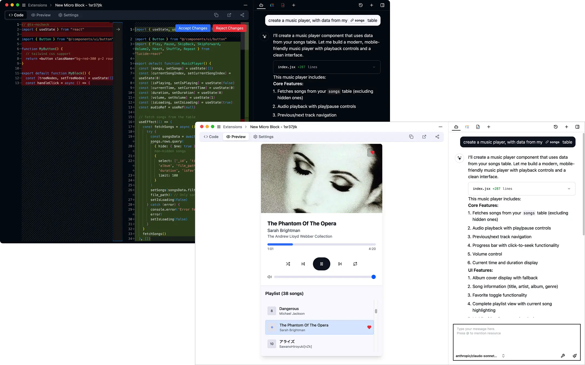

  <h1 align="center">
  <picture>
    <source media="(prefers-color-scheme: dark)" srcset="static/assets/images/eidos-logo-horizontal-dark.webp">
    
  </picture>
  </h1>
<h3>
   An extensible framework for Personal Data Management.
</h3>

  
  
  
  
  

> [!IMPORTANT]
> Eidos is under active development. While you can try it out, it's not recommended for production use. Stay tuned for updates on the official release.

## Features

- Out-of-the-box Notion-like documents and databases
- Offline Support: Everything runs inside your local machine. Access your data without an internet connection. Data is stored locally for blazing-fast performance.
- AI Features: Deeply integrated with LLM for AI-powered capabilities. Translate, summarize, and interact with your data within Eidos.
- Extensible: Simple and powerful extension system, make Eidos a malleable software, write extension code manually or use AI to generate extension code. Build tools and use tools, unlimited extension.

  

  

    Block: UI components for customized data display and interaction.
  

    
  

  

  

    Script: Create powerful data processing logic with TypeScript/JavaScript/Python. 
  

    
    
  

- Open Format: You get the raw data, everything in sqlite is open.

## How to use

Get the app from: https://eidos.space/download

## How to develop

1. Clone the repository `git clone https://github.com/mayneyao/eidos.git`
2. Run `pnpm install` to install dependencies
3. For desktop development:
   - Run `cd apps/desktop && node scripts/download-libsimple.cjs` to download libsimple (only for the first time)
   - Run `pnpm dev:desktop` to start the desktop app
4. For web development:
   - Run `pnpm dev` to start the web app (PWA)

## How Eidos works

For more details, visit https://docs.eidos.space/

## Contributors

## License

This project is licensed under the terms of the AGPL license.
