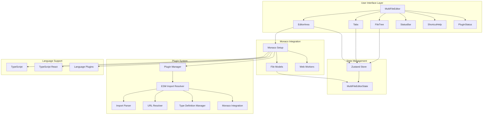
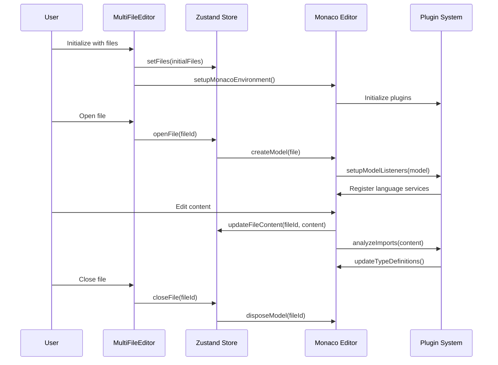

# Code Editor Architecture Overview

## 📋 Table of Contents

- [Overview](#overview)
- [Architecture Diagram](#architecture-diagram)
- [Core Components](#core-components)
- [Data Flow](#data-flow)
- [Plugin System](#plugin-system)
- [State Management](#state-management)
- [Monaco Integration](#monaco-integration)

## Overview

The `@eidos.space/code-editor` package provides a VSCode-like multi-file code editing experience built on Monaco Editor. It's designed specifically for the Eidos extension system with TypeScript support, ESM import resolution, and a modular plugin architecture.

## Architecture Diagram



## Core Components

### 1. MultiFileEditor (Main Component)

The root component that orchestrates the entire editor experience.

**Key Features:**
- Async Monaco initialization
- Layout management
- Component coordination
- Keyboard shortcuts integration

**Props:**
- `initialFiles`: Initial file list
- `initialOpenFiles`: Initially opened files
- `initialActiveFileId`: Initially active file
- `autoInitialize`: Auto-initialization flag
- `className`: Custom styling

### 2. FileTree Component

Provides file system navigation and management.

**Features:**
- Hierarchical file display
- File/folder creation
- Drag & drop support
- Context menu operations
- File type icons

### 3. Tabs Component

Manages open file tabs similar to VSCode.

**Features:**
- Tab switching
- Tab closing
- Drag & drop reordering
- Modified file indicators
- Keyboard navigation

### 4. EditorArea Component

The main Monaco Editor integration component.

**Features:**
- Monaco Editor instance management
- Model creation and disposal
- Theme configuration
- Language service integration
- Plugin coordination

### 5. StatusBar Component

Displays editor status and file information.

**Features:**
- Current file info
- Line/column position
- Language indicator
- Plugin status
- Error/warning counts

## Data Flow



## Plugin System

The editor uses a modular plugin architecture for extensibility.

### Plugin Manager

Central coordinator for all plugins with lifecycle management.

**Features:**
- Plugin registration and initialization
- Dependency management
- Configuration handling
- Error isolation

### ESM Import Resolver Plugin

Provides intelligent import resolution and type definitions.

**Components:**
- **Import Parser**: Analyzes import statements
- **URL Resolver**: Resolves package URLs
- **Type Definition Manager**: Fetches and manages type definitions
- **Monaco Integration**: Integrates with Monaco language services

**Features:**
- Auto-completion for package names
- Hover information for imports
- Type definition fetching
- Code actions for import resolution

## State Management

Uses Zustand for lightweight, efficient state management.

### State Structure

```typescript
interface MultiFileEditorState {
  // File management
  files: FileModel[]
  openFiles: string[]
  activeFileId: string | null
  fileModels: Record<string, monaco.editor.ITextModel>
  
  // Actions
  setFiles: (files: FileModel[]) => void
  addFile: (file: FileModel) => void
  removeFile: (fileId: string) => void
  updateFileContent: (fileId: string, content: string) => void
  // ... more actions
}
```

### Key Features

- **Immutable updates**: Ensures predictable state changes
- **Model lifecycle management**: Automatic Monaco model cleanup
- **File operations**: Complete CRUD operations for files
- **Tab management**: Open/close file tracking

## Monaco Integration

### Setup Process

1. **Worker Configuration**: Sets up TypeScript and editor workers
2. **Loader Initialization**: Configures Monaco loader
3. **Plugin Initialization**: Initializes all plugins
4. **Model Management**: Creates and manages file models

### Key Features

- **Multi-file support**: Each file gets its own Monaco model
- **TypeScript support**: Full language service integration
- **Path mapping**: Virtual file system with `@/scripts/*` paths
- **Memory management**: Automatic model disposal

### Configuration

```typescript
const compilerOptions = {
  target: ScriptTarget.ES2020,
  module: ModuleKind.ESNext,
  moduleResolution: ModuleResolutionKind.NodeJs,
  allowSyntheticDefaultImports: true,
  esModuleInterop: true,
  jsx: JsxEmit.React,
  strict: false,
  skipLibCheck: true
}
```

## Performance Considerations

### Memory Management

- **Model Disposal**: Automatic cleanup prevents memory leaks
- **Plugin Lifecycle**: Proper disposal of event listeners
- **Worker Sharing**: Efficient use of web workers
- **Lazy Loading**: Plugins and features load on demand

### Optimization Strategies

- **Virtual File System**: Efficient path resolution
- **Incremental Analysis**: Only analyze changed imports
- **Type Caching**: Cache fetched type definitions
- **Debounced Updates**: Prevent excessive re-analysis

## Browser Compatibility

- **Modern Browsers**: Chrome 80+, Firefox 75+, Safari 13+
- **ES6+ Features**: Requires modern JavaScript support
- **Web Workers**: Essential for TypeScript language service
- **WASM Support**: For advanced parsing features
