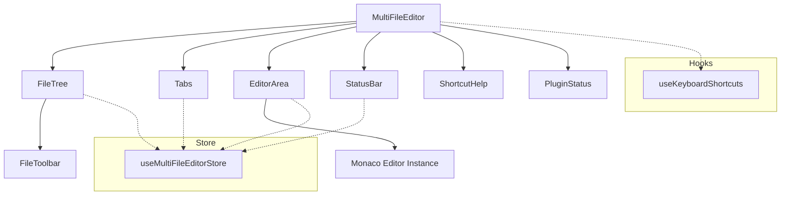
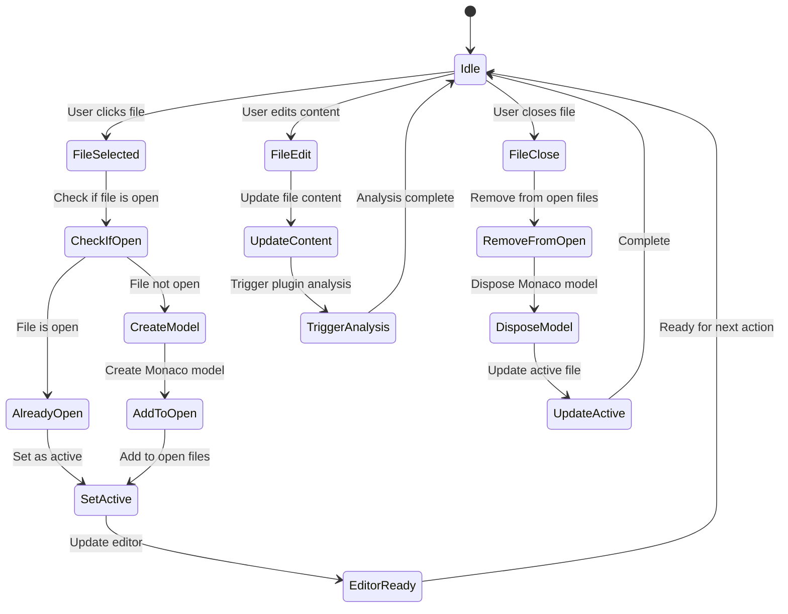
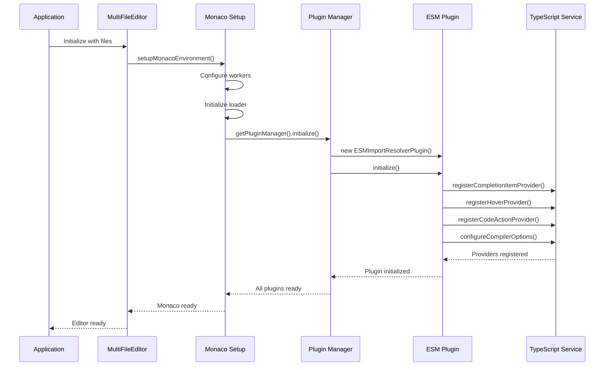
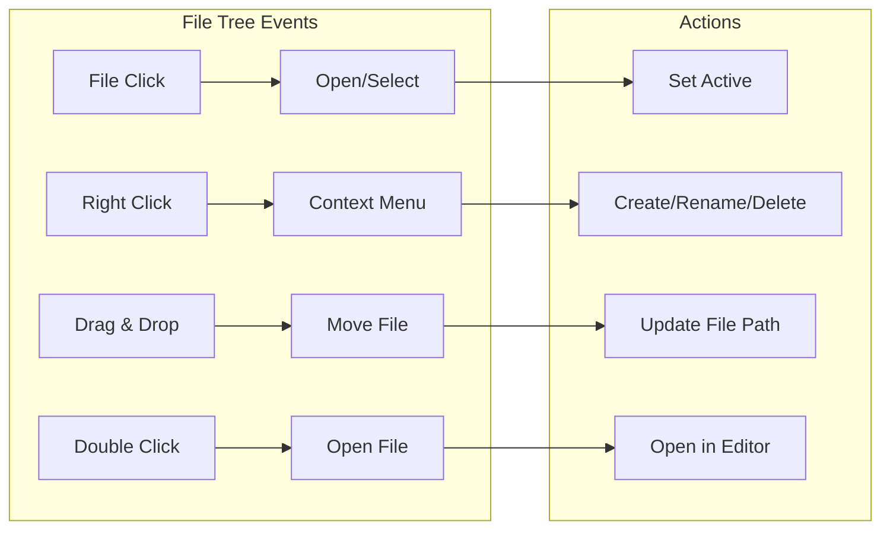
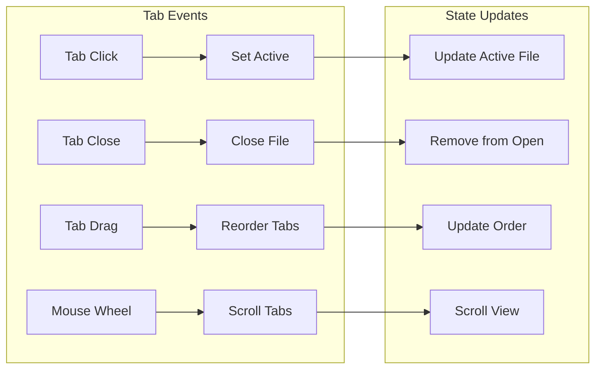
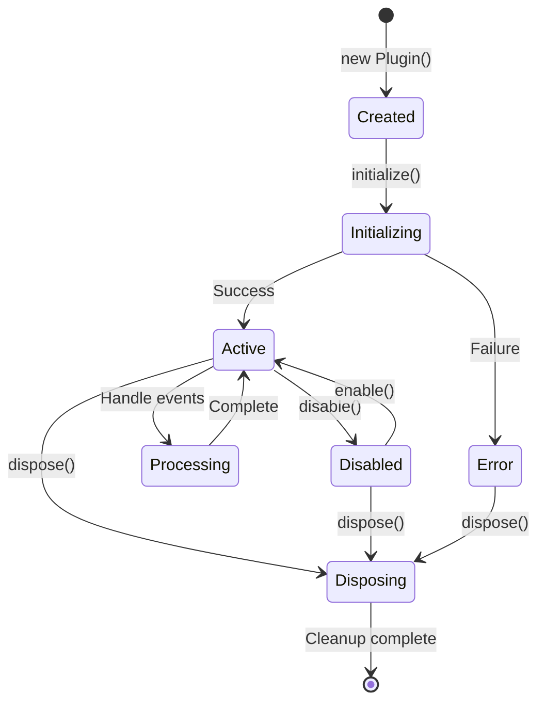
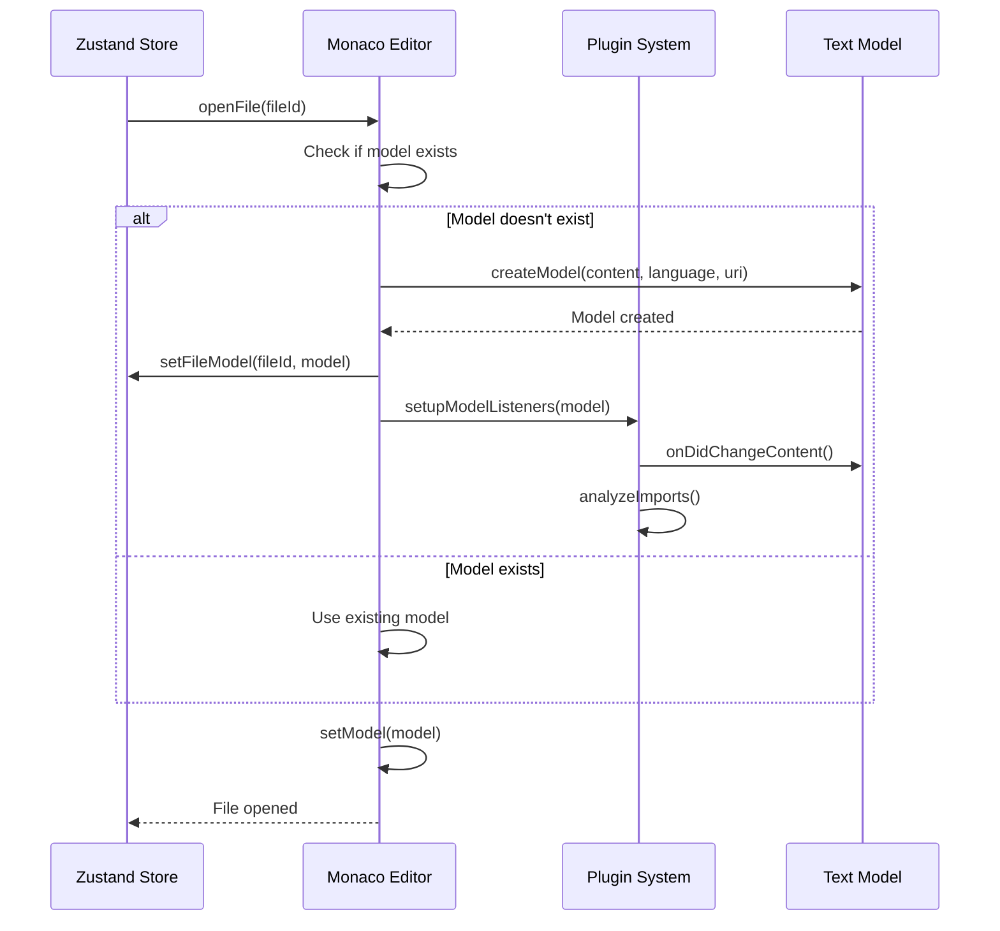
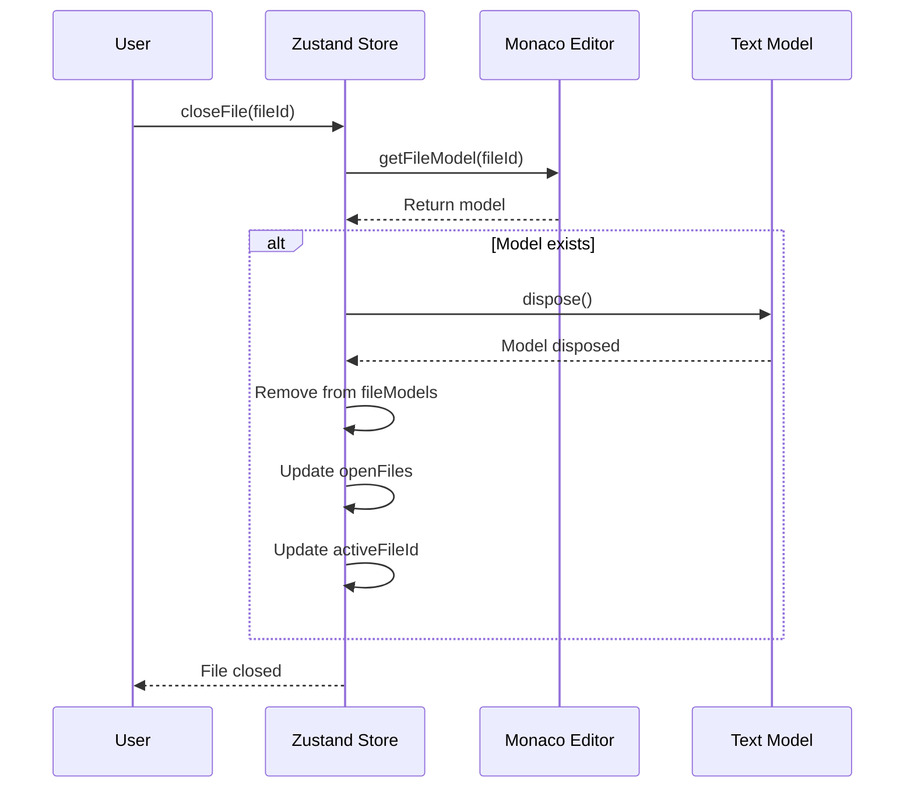

# Component Interactions and Data Flow

## 📋 Table of Contents

- [Component Hierarchy](#component-hierarchy)
- [State Flow Diagrams](#state-flow-diagrams)
- [Event Handling](#event-handling)
- [Plugin Integration](#plugin-integration)
- [Monaco Model Lifecycle](#monaco-model-lifecycle)

## Component Hierarchy



## State Flow Diagrams

### File Operations Flow



### Plugin Initialization Flow



## Event Handling

### Keyboard Shortcuts

The editor implements comprehensive keyboard shortcuts through the `useKeyboardShortcuts` hook:

```typescript
// Key bindings
const shortcuts = {
  'Ctrl+S': 'Save file',
  'Ctrl+W': 'Close tab',
  'Ctrl+Tab': 'Next tab',
  'Ctrl+Shift+Tab': 'Previous tab',
  'Ctrl+1-9': 'Switch to tab N',
  'F2': 'Rename file',
  'Alt+Shift+F': 'Format document'
}
```

### File Tree Events



### Tab Events



## Plugin Integration

### ESM Import Resolver Integration

```mermaid
graph TB
    subgraph "Monaco Editor"
        MODEL[Text Model]
        LS[Language Service]
        CP[Completion Provider]
        HP[Hover Provider]
        CAP[Code Action Provider]
    end
    
    subgraph "ESM Plugin"
        IP[Import Parser]
        UR[URL Resolver]
        TDM[Type Definition Manager]
        MI[Monaco Integration]
    end
    
    subgraph "External Services"
        CDN[CDN/Registry]
        TYPES[Type Definitions]
    end
    
    MODEL --> IP: Content changes
    IP --> UR: Parse imports
    UR --> TDM: Resolve URLs
    TDM --> CDN: Fetch types
    CDN --> TYPES: Return definitions
    TYPES --> MI: Register types
    MI --> LS: Update language service
    
    LS --> CP: Provide completions
    LS --> HP: Provide hover info
    LS --> CAP: Provide code actions
```

### Plugin Lifecycle



## Monaco Model Lifecycle

### Model Creation and Management



### Model Disposal



### Memory Management

The editor implements careful memory management to prevent leaks:

1. **Model Disposal**: Automatic cleanup when files are closed
2. **Plugin Cleanup**: Disposable pattern for event listeners
3. **Worker Management**: Shared workers for efficiency
4. **State Cleanup**: Immutable updates with proper cleanup

```typescript
// Example cleanup pattern
const disposables: monaco.IDisposable[] = []

// Register disposable
const provider = monaco.languages.registerCompletionItemProvider(...)
disposables.push(provider)

// Cleanup
disposables.forEach(d => d.dispose())
disposables.length = 0
```
