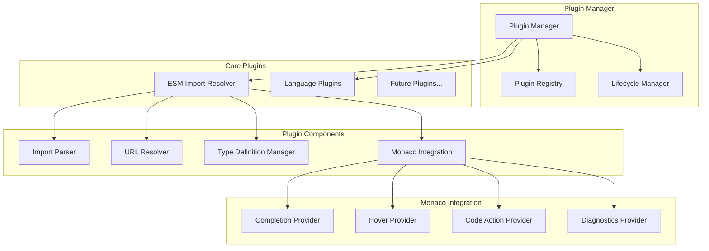
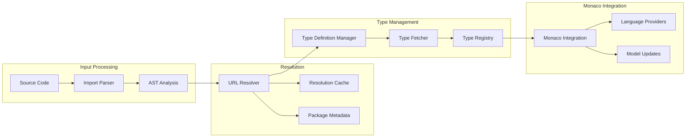

# Plugin System Architecture

## 📋 Table of Contents

- [Overview](#overview)
- [Plugin Architecture](#plugin-architecture)
- [ESM Import Resolver](#esm-import-resolver)
- [Plugin Development](#plugin-development)
- [Configuration](#configuration)
- [Extension Points](#extension-points)

## Overview

The code editor uses a modular plugin system that extends Monaco Editor's capabilities. The system is designed for:

- **Modularity**: Each plugin is self-contained
- **Extensibility**: Easy to add new language features
- **Performance**: Lazy loading and efficient resource management
- **Isolation**: Plugins don't interfere with each other

## Plugin Architecture



### Plugin Interface

All plugins implement the base `Plugin` interface:

```typescript
interface Plugin {
  name: string
  version: string
  initialize(): Promise<void>
  dispose(): void
  isEnabled(): boolean
  enable(): void
  disable(): void
}
```

### Plugin Manager

The `PluginManager` coordinates plugin lifecycle and provides:

- **Registration**: Plugin discovery and registration
- **Initialization**: Ordered plugin startup
- **Configuration**: Plugin-specific settings
- **Disposal**: Clean shutdown and resource cleanup

```typescript
class PluginManager {
  private plugins = new Map<string, Plugin>()
  private initialized = false
  
  async initialize(): Promise<void>
  dispose(): void
  getPlugin(name: string): Plugin | undefined
  getAllPlugins(): Plugin[]
}
```

## ESM Import Resolver

The flagship plugin that provides intelligent ES module import support.

### Architecture



### Import Parser

Analyzes TypeScript/JavaScript code to extract import statements:

```typescript
class ImportParser {
  async parseImports(content: string, filePath: string): Promise<ImportInfo[]>
}

interface ImportInfo {
  source: string          // Original import path
  resolved: string        // Resolved URL/path
  isThirdParty: boolean   // External package
  isNodeBuiltin: boolean  // Node.js builtin
  isRelative: boolean     // Relative path
  specifiers: string[]    // Imported names
}
```

### URL Resolver

Converts import paths to resolvable URLs:

```typescript
class URLResolver {
  resolvePackageUrl(packageName: string): string
  getPackageMetadata(packageName: string): PackageMetadata
  setEsmServerUrl(url: string): void
  addToWhitelist(packageName: string): void
  addToBlacklist(packageName: string): void
}
```

**Resolution Strategy:**
1. **Node Builtins**: `fs`, `path`, etc. → Node.js documentation
2. **Relative Paths**: `./file.ts` → Local file resolution
3. **Package Names**: `react` → CDN URL (esm.sh, unpkg, etc.)
4. **Scoped Packages**: `@types/node` → Scoped resolution

### Type Definition Manager

Fetches and manages TypeScript type definitions:

```typescript
class TypeDefinitionManager {
  async fetchTypes(packageUrl: string): Promise<TypeDefinition | null>
  cacheTypes(packageName: string, types: TypeDefinition): void
  getFromCache(packageName: string): TypeDefinition | null
}

interface TypeDefinition {
  packageName: string
  version: string
  content: string
  dependencies: string[]
  uri: string
}
```

**Type Resolution Flow:**
1. Check local cache
2. Fetch from CDN (esm.sh/types, unpkg/@types)
3. Parse and validate TypeScript definitions
4. Register with Monaco TypeScript service
5. Cache for future use

### Monaco Integration

Bridges plugin functionality with Monaco Editor:

```typescript
class MonacoIntegration {
  registerTypeDefinitions(types: TypeDefinition[]): void
  updateCompilerOptions(options: CompilerOptions): void
  createCompletionProvider(): CompletionItemProvider
  createHoverProvider(): HoverProvider
  createCodeActionProvider(): CodeActionProvider
}
```

## Plugin Development

### Creating a New Plugin

1. **Implement Plugin Interface**:

```typescript
class MyPlugin implements Plugin {
  name = 'My Plugin'
  version = '1.0.0'
  private enabled = false
  
  async initialize(): Promise<void> {
    // Setup plugin
    this.enabled = true
  }
  
  dispose(): void {
    // Cleanup resources
    this.enabled = false
  }
  
  isEnabled(): boolean {
    return this.enabled
  }
  
  enable(): void {
    if (!this.enabled) {
      this.initialize()
    }
  }
  
  disable(): void {
    this.dispose()
  }
}
```

2. **Register with Plugin Manager**:

```typescript
const pluginManager = getPluginManager()
const myPlugin = new MyPlugin()
pluginManager.registerPlugin('my-plugin', myPlugin)
```

### Language Provider Examples

**Completion Provider**:
```typescript
monaco.languages.registerCompletionItemProvider('typescript', {
  triggerCharacters: ['.', '"', "'"],
  provideCompletionItems: async (model, position) => {
    // Analyze context and provide suggestions
    return {
      suggestions: [
        {
          label: 'myFunction',
          kind: monaco.languages.CompletionItemKind.Function,
          insertText: 'myFunction()',
          detail: 'Custom function'
        }
      ]
    }
  }
})
```

**Hover Provider**:
```typescript
monaco.languages.registerHoverProvider('typescript', {
  provideHover: async (model, position) => {
    // Provide hover information
    return {
      range: new monaco.Range(line, startCol, line, endCol),
      contents: [
        { value: '**Function**: myFunction' },
        { value: 'Description of the function' }
      ]
    }
  }
})
```

## Configuration

### Plugin Manager Options

```typescript
interface PluginManagerOptions {
  enableESMResolver?: boolean
  esmResolverConfig?: {
    esmServerUrl?: string
    packageWhitelist?: string[]
    packageBlacklist?: string[]
    enableAutoTypeResolution?: boolean
  }
}
```

### ESM Resolver Configuration

```typescript
const config = {
  esmServerUrl: 'https://esm.sh',
  packageWhitelist: ['react', 'lodash'], // Only allow these
  packageBlacklist: ['dangerous-package'], // Block these
  enableAutoTypeResolution: true
}
```

## Extension Points

### Available Extension Points

1. **Language Providers**:
   - Completion
   - Hover
   - Code Actions
   - Diagnostics
   - Formatting

2. **Model Listeners**:
   - Content changes
   - Model creation/disposal
   - Language changes

3. **Editor Events**:
   - Focus/blur
   - Selection changes
   - Cursor position

4. **File System**:
   - File operations
   - Path resolution
   - Content loading

### Plugin Communication

Plugins can communicate through:

1. **Shared Services**: Common utilities and caches
2. **Event System**: Plugin-to-plugin messaging
3. **Monaco APIs**: Shared Monaco Editor instance
4. **Store Integration**: Access to editor state

```typescript
// Example: Plugin communication
class PluginA implements Plugin {
  async initialize() {
    // Listen for events from other plugins
    eventBus.on('plugin-b-event', this.handleEvent)
  }
  
  private handleEvent = (data: any) => {
    // React to other plugin events
  }
}
```
