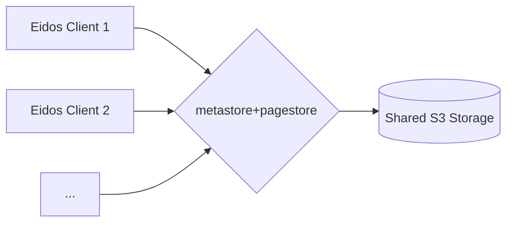

# Sync Service [WIP]

This document describes how to deploy and manage the sync services using Docker Compose.

## How it Works

The sync service acts as an intermediary between multiple Eidos clients and a shared S3-compatible object storage backend. The architecture facilitates data synchronization across different client instances.

1.  **Eidos Clients:** Multiple client applications (e.g., on different devices) initiate requests for data synchronization.
2.  **Sync Service (`metastore` & `pagestore`):** These services are stateless and can be horizontally scaled. Each instance receives requests from clients.
    - `metastore` handles metadata operations.
    - `pagestore` handles page content operations.
      Crucially, all running instances of `metastore` and `pagestore` are configured to connect to the _same_ S3 backend.
3.  **S3-Compatible Storage:** This single, shared backend (e.g., MinIO, AWS S3, Cloudflare R2) stores all metadata and page content persistently. It acts as the single source of truth.

Because the sync services are stateless and all instances point to the same S3 backend, changes made by one client are reflected for other clients once they sync. This allows seamless data synchronization across devices.



## Conflict Handling

Eidos is designed primarily for personal use across multiple devices. In most scenarios with a stable connection, conflicts are unlikely because:

1.  **Sequential Writes:** Clients write changes to the shared S3 backend via the sync service in the order they are received.
2.  **Frequent Sync:** Clients attempt to synchronize with the backend every second.

However, conflicts _can_ occur if a client operates offline or in a weak network environment for a period and then attempts to sync changes that conflict with newer data already stored on the server.

**Current Resolution Strategy:**

The current approach prioritizes simplicity and data consistency based on the server's state:

- If a client attempts to push changes that conflict with the server version, the client's conflicting changes are discarded.
- The client is then reset to the latest version available on the server.

This behavior is similar to performing a `git pull` where remote changes overwrite local conflicting changes, ensuring all devices eventually converge to the state stored in the shared S3 backend. You can conceptualize the system as a Git repository with automatic, frequent `push` and `pull` operations.

## Services

This setup includes the following services:

- `metastore`: Manages metadata. Image: `ghcr.io/orbitinghail/metastore:0.1.4`
- `pagestore`: Manages page data. Image: `ghcr.io/orbitinghail/pagestore:0.1.4`
- `minio`: S3-compatible object storage used by `metastore` and `pagestore`. Image: `minio/minio:latest`

## Prerequisites

- Docker installed: [https://docs.docker.com/get-docker/](https://docs.docker.com/get-docker/)
- Docker Compose installed (usually included with Docker Desktop): [https://docs.docker.com/compose/install/](https://docs.docker.com/compose/install/)

## Configuration

The services are configured via environment variables within the `docker-compose.yaml` file. Key configurations include:

- **AWS Credentials & Endpoint:** `metastore` and `pagestore` are configured to use the local `minio` service as an S3-compatible backend (`AWS_ENDPOINT=http://minio:9000`). The credentials (`AWS_ACCESS_KEY_ID`, `AWS_SECRET_ACCESS_KEY`) are set to match the `minio` service's `MINIO_ROOT_USER` and `MINIO_ROOT_PASSWORD`.
- **Metastore Endpoint:** `pagestore` is configured to connect to `metastore` via `PAGESTORE_METASTORE=http://metastore:3001`.
- **Minio:** Configured with default user/password (`minio`/`minio-secret`) and creates a default bucket `graft-primary`. Data is persisted in the `minio_data` Docker volume.

If deploying to a different environment (e.g., using a cloud S3 provider), you will need to update the `AWS_*` environment variables for `metastore` and `pagestore` accordingly.

## Usage

### Starting the Services

Navigate to the `packages/sync` directory in your terminal and run:

```bash
docker-compose up -d
```

This command will:

1.  Pull the necessary Docker images if they are not already present locally.
2.  Create and start the containers for `metastore`, `pagestore`, and `minio` in detached mode (`-d`).
3.  Create the `basic-net` network and `minio_data` volume if they don't exist.

### Checking Service Status

You can check the status of the running containers:

```bash
docker-compose ps
```

### Viewing Logs

To view the logs for all services:

```bash
docker-compose logs -f
```

To view logs for a specific service (e.g., `pagestore`):

```bash
docker-compose logs -f pagestore
```

### Stopping the Services

To stop the running services:

```bash
docker-compose down
```

This command will stop and remove the containers and the network defined in the `docker-compose.yaml` file. The `minio_data` volume will persist unless explicitly removed.

To stop and remove the containers, network, _and_ the data volume:

```bash
docker-compose down -v
```

## Accessing Services

- **Metastore:** Accessible at `http://localhost:3001` (or the host machine's IP if not running locally).
- **Pagestore:** Accessible at `http://localhost:3000`.
- **Minio Console:** Accessible at `http://localhost:9001` (login with `minio`/`minio-secret`).
- **Minio S3 API:** Accessible at `http://localhost:9000`.
