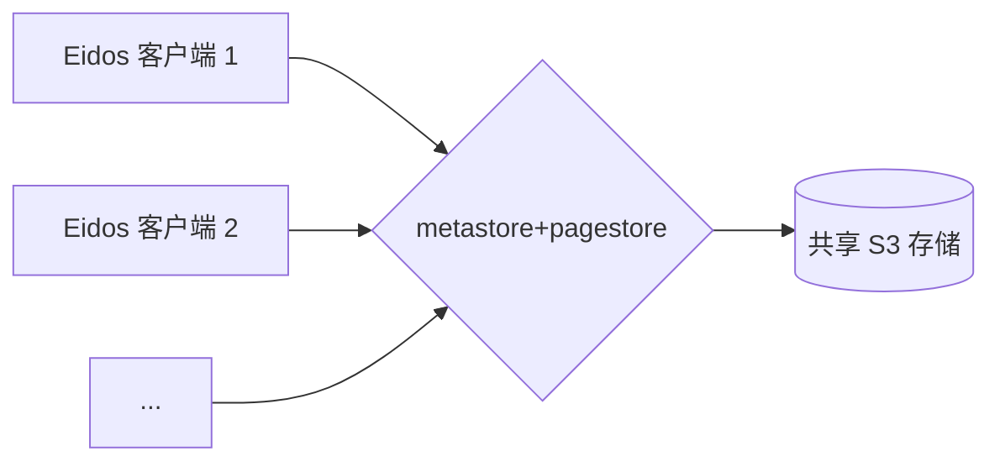

# 同步服务 [WIP]

本文档介绍如何使用 Docker Compose 部署和管理同步服务。

## 工作原理

同步服务充当多个 Eidos 客户端和共享的 S3 兼容对象存储后端之间的中介。该架构促进了不同客户端实例之间的数据同步。

1.  **Eidos 客户端:** 多个客户端应用程序（例如，在不同的设备上）发起数据同步请求。
2.  **同步服务 (`metastore` & `pagestore`):** 这些服务是无状态的，可以水平扩展。每个实例接收来自客户端的请求。
    - `metastore` 处理元数据操作。
    - `pagestore` 处理页面内容操作。
      关键在于，所有运行中的 `metastore` 和 `pagestore` 实例都配置为连接到*同一个* S3 后端。
3.  **S3 兼容存储:** 这个单一、共享的后端（例如，MinIO、AWS S3、Cloudflare R2）持久存储所有元数据和页面内容。它充当单一事实来源。

由于同步服务是无状态的，并且所有实例都指向同一个 S3 后端，因此一个客户端所做的更改在其他客户端同步后即可反映出来。这使得跨设备的无缝数据同步成为可能。



## 冲突处理

Eidos 主要设计用于个人在多个设备上使用。在大多数连接稳定的情况下，冲突不太可能发生，因为：

1.  **顺序写入:** 客户端通过同步服务按接收顺序将更改写入共享的 S3 后端。
2.  **频繁同步:** 客户端尝试每秒与后端同步一次。

但是，如果客户端在离线或弱网络环境中运行一段时间，然后尝试同步与服务器上已存储的较新数据冲突的更改，则*可能*会发生冲突。

**当前的解决策略：**

当前的方法优先考虑基于服务器状态的简单性和数据一致性：

- 如果客户端尝试推送与服务器版本冲突的更改，则客户端的冲突更改将被丢弃。
- 然后客户端将重置为服务器上可用的最新版本。

此行为类似于执行 `git pull`，其中远程更改会覆盖本地冲突的更改，确保所有设备最终都收敛到共享 S3 后端中存储的状态。您可以将该系统概念化为一个具有自动、频繁 `push` 和 `pull` 操作的 Git 存储库。

## 服务

此设置包括以下服务：

- `metastore`: 管理元数据。镜像: `ghcr.io/orbitinghail/metastore:0.1.4`
- `pagestore`: 管理页面数据。镜像: `ghcr.io/orbitinghail/pagestore:0.1.4`
- `minio`: `metastore` 和 `pagestore` 使用的 S3 兼容对象存储。镜像: `minio/minio:latest`

## 先决条件

- 已安装 Docker: [https://docs.docker.com/get-docker/](https://docs.docker.com/get-docker/)
- 已安装 Docker Compose（通常包含在 Docker Desktop 中）: [https://docs.docker.com/compose/install/](https://docs.docker.com/compose/install/)

## 配置

服务通过 `docker-compose.yaml` 文件中的环境变量进行配置。关键配置包括：

- **AWS 凭证和端点:** `metastore` 和 `pagestore` 配置为使用本地 `minio` 服务作为 S3 兼容后端 (`AWS_ENDPOINT=http://minio:9000`)。凭证 (`AWS_ACCESS_KEY_ID`, `AWS_SECRET_ACCESS_KEY`) 设置为与 `minio` 服务的 `MINIO_ROOT_USER` 和 `MINIO_ROOT_PASSWORD` 匹配。
- **Metastore 端点:** `pagestore` 配置为通过 `PAGESTORE_METASTORE=http://metastore:3001` 连接到 `metastore`。
- **Minio:** 配置了默认用户/密码 (`minio`/`minio-secret`) 并创建了一个默认存储桶 `graft-primary`。数据持久化在 `minio_data` Docker 卷中。

如果部署到不同的环境（例如，使用云 S3 提供商），则需要相应地更新 `metastore` 和 `pagestore` 的 `AWS_*` 环境变量。

## 使用方法

### 启动服务

在终端中导航到 `packages/sync` 目录并运行：

```bash
docker-compose up -d
```

此命令将：

1.  如果本地不存在所需的 Docker 镜像，则拉取它们。
2.  在分离模式 (`-d`) 下创建并启动 `metastore`、`pagestore` 和 `minio` 的容器。
3.  如果 `basic-net` 网络和 `minio_data` 卷不存在，则创建它们。

### 检查服务状态

您可以检查正在运行的容器的状态：

```bash
docker-compose ps
```

### 查看日志

查看所有服务的日志：

```bash
docker-compose logs -f
```

查看特定服务的日志（例如，`pagestore`）：

```bash
docker-compose logs -f pagestore
```

### 停止服务

停止正在运行的服务：

```bash
docker-compose down
```

此命令将停止并删除 `docker-compose.yaml` 文件中定义的容器和网络。除非显式删除，否则 `minio_data` 卷将持久存在。

停止并删除容器、网络*和*数据卷：

```bash
docker-compose down -v
```

## 访问服务

- **Metastore:** 可在 `http://localhost:3001` 访问（如果不在本地运行，则为宿主机的 IP）。
- **Pagestore:** 可在 `http://localhost:3000` 访问。
- **Minio 控制台:** 可在 `http://localhost:9001` 访问（使用 `minio`/`minio-secret` 登录）。
- **Minio S3 API:** 可在 `http://localhost:9000` 访问。
